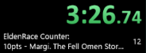
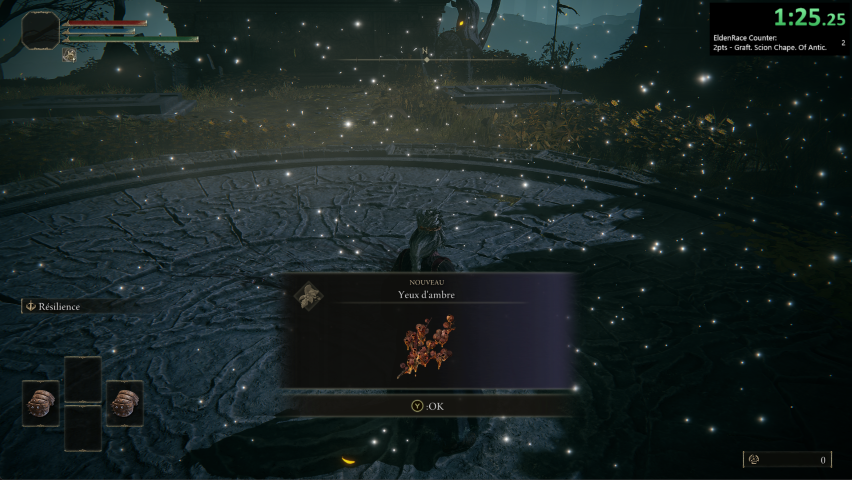
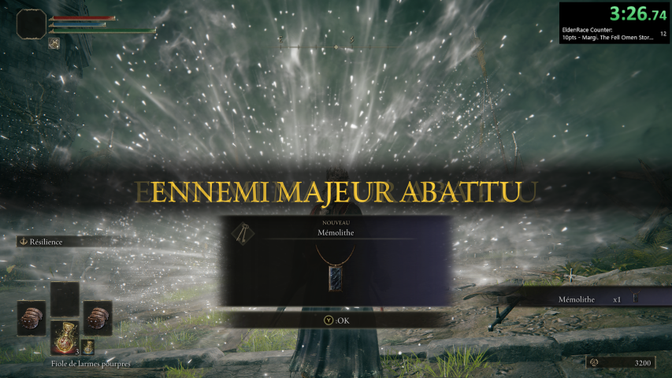

# LiveSplit.EldenRaceCounter

[LiveSplit](https://livesplit.org/) plugin to automatically count points for an [EldenRace](https://arshesl.notion.site/6d3f8eae9d994bce813ef57753ac5630?v=33f75a56fc924cf6b136d0948e773baa).

It is based on the [LiveSplit.Counter](https://github.com/LiveSplit/LiveSplit.Counter) plugin and depends on [SoulMemory](https://github.com/FrankvdStam/SoulSplitter/tree/main/src/SoulMemory) to interact with the game instance.



Plugin tested with LiveSplit 1.8.28

> **Note**: Currently only bosses' kill are considered.

## Installation

1. Download the LiveSplit release archive from their [GitHub repository](https://github.com/LiveSplit/LiveSplit/releases) or [website](https://livesplit.org/downloads/)
2. Unzip the archive
3. Download the latest [LiveSplit.EldenRaceCounter release archive](https://github.com/RadaKk/LiveSplit.EldenRaceCounter/releases). It should contain: `SoulMemory.dll`, `LiveSplit.EldenRaceCounter.dll` and `EldenRace.lsl`
4. Place the DLLs in your local LiveSplit folder `.../LiveSplit/Components` and the `EldenRace.lsl` anywhere you want

## How to create a basic layout using this plugin?

If you have already run LiveSplit once, simply run the pre-configured layout `EldenRace.lsl`.  
Otherwise, In LiveSplit, right-click on the timer, `Open Layout / From File...` and navigate to `EldenRace.lsl`.

This will load the pre-configured layout with the default configuration will be loaded. However, it is possible to configure the points settings:

- Right-click on the LiveSplit window
- Navigate to: `Edit Layout... / Layout Settings / EldenRace Counter`
- Click on `Write default config` and save it
- Edit the saved file as you wish
- Click on `Open points configuration` and select the edited file
- Click on `OK` on `Layout Settings` and `Layout Editor` windows
- Done!

## Precisions and options

- This plugin can be found in the section `Other` from `Edit Layout... / +`
- The counter is linked to the timer status, i.e., the timer should be started for the points to be counted (although adding a timer element to the layout is not mandatory)
- The points are counted based on memory events flags; those flags are not reset for a character. If you stop the game or LiveSplit and start again, the points should be counted correctly
- `Open points configuration`: `csv` file with two columns separated by `,`
    - The first column is the name of the event from SoulMemory enums ([Boss](https://github.com/FrankvdStam/SoulSplitter/blob/main/src/SoulMemory/EldenRing/Boss.cs), [ItemPickup](https://github.com/FrankvdStam/SoulSplitter/blob/main/src/SoulMemory/EldenRing/ItemPickup.cs) - Only Bosses used for now)
    - The second is the amount of points to add when the event occurs

    Example:

    ```csv
    GodrickTheGraftedStormveilCastle,10
    MargitTheFellOmenStormveilCastle,10
    GraftedScionChapelOfAnticipation,2
    ```
    > **Note**: Double minor bosses, such as Crucible Knight & Crucible Knight Ordovis, have 2 entries in the point configuration file.  
    > kill any of them will trigger the same memory event; therefore, they cannot be distinguished, do not set different points for them.
    
- `Write default config`: output the configuration `csv` with the correct format with 2 categories (default major bosses: 10pts and all others: 2pts).
- `Random spoil log`: use the `spoiler_logs/.*.txt` file from the [Enemy randomizer mode](https://www.nexusmods.com/eldenring/mods/428). If the default configuration is not used, it will correctly map the boss points with the randomizer.

## Gallery





## Thanks to

[TheSoundDefense](https://gist.github.com/TheSoundDefense) for the great introduction to LiveSplit Component with [Tutorial - how to create a LiveSplit component](https://gist.github.com/TheSoundDefense/cf85fd68ae582faa5f1cc95f18bba4ec)
